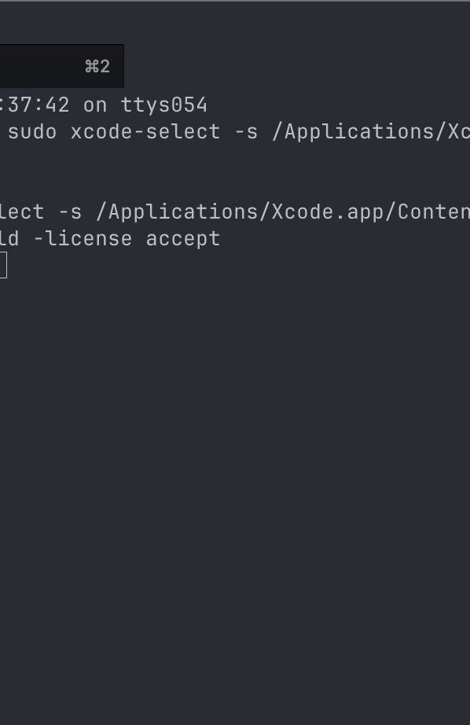

# Pomodoro

A minimal Pomodoro timer that lives in the macOS menu bar. There are many of these little Pomodoro apps on the internet, but most of them are scammy adware, or there's a small fee with bloated premium features. This one is free and designed exactly for my minimalist needs.



## Features

- 25-minute work timer, 5-minute break
- Start / Pause / Reset controls
- Circular progress ring with countdown in the menu bar
- Log what you're working on before each session
- Add notes during a session
- Reflect on what you accomplished after each session
- macOS notification when timer completes
- Plain text log file for easy querying
- Configurable log file location
- No dock icon — lives entirely in the menu bar

## Install

**Requires macOS 14+**

1. Download `Pomodoro-v1.0.zip` from the [latest release](https://github.com/woojae/pomodoro/releases/latest)
2. Unzip and drag `Pomodoro.app` to `/Applications`
3. Since the app isn't notarized, right-click the app and select **Open** the first time to bypass Gatekeeper
4. To start on login: **System Settings > General > Login Items > add Pomodoro.app**

## Build from Source

If you'd prefer to build it yourself:

```bash
brew install xcodegen
xcodegen generate
DEVELOPER_DIR=/Applications/Xcode.app/Contents/Developer xcodebuild \
  -project Pomodoro.xcodeproj \
  -scheme Pomodoro \
  -configuration Release \
  build
cp -r ~/Library/Developer/Xcode/DerivedData/Pomodoro-*/Build/Products/Release/Pomodoro.app /Applications/
```

## Log Format

Sessions are logged to `~/pomodoro.log` (configurable in Settings). Each line is tab-separated:

```
2026-02-18 10:00:00	start	Fix login bug
2026-02-18 10:05:32	note	Found root cause in token refresh
2026-02-18 10:12:15	note	Also need to update tests
2026-02-18 10:25:00	done	Rewrote auth token refresh logic
```

## Shell Helper

Add this to your `~/.zshrc` (or `~/.bashrc`):

```bash
pomo() {
  case "$1" in
    yesterday) grep "$(date -v-1d +%Y-%m-%d)" ~/pomodoro.log ;;
    search)    grep -i "$2" ~/pomodoro.log ;;
    *)         grep "$(date +%Y-%m-%d)" ~/pomodoro.log ;;
  esac
}
```

Then `source ~/.zshrc` and use:

```bash
pomo                    # today's entries
pomo yesterday          # yesterday's entries
pomo search login       # search all entries (case-insensitive)
```
